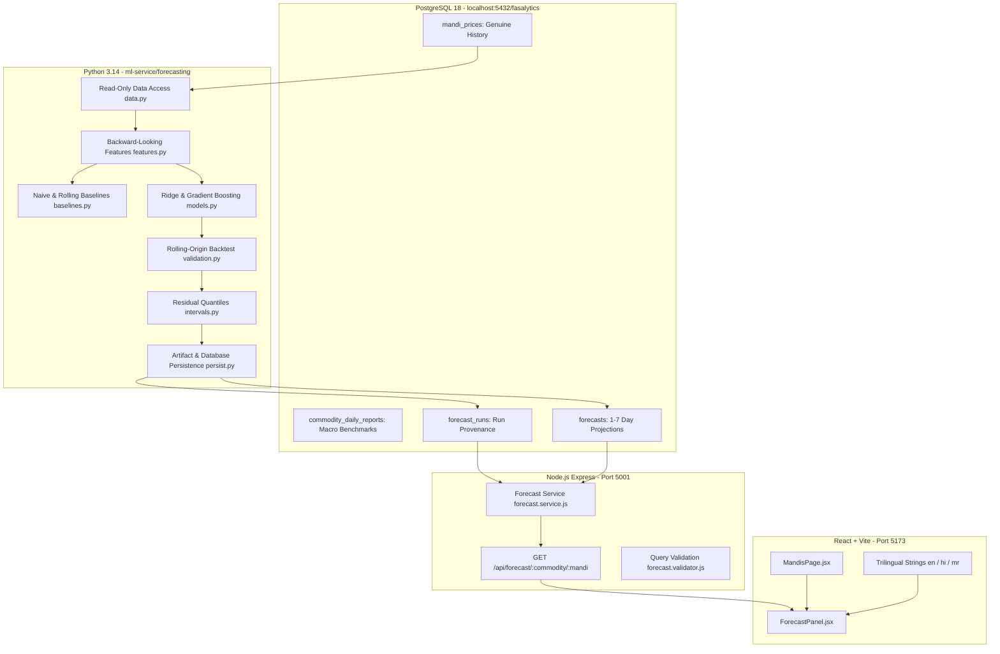

# FASALYTICS Phase 4 — AI-Based Mandi Price Forecasting Architecture

## 1. System Overview

Phase 4 introduces an end-to-end, multi-horizon agricultural price forecasting system for Indian APMC mandis. It builds on the verified Phase 3 PostgreSQL market data pipeline, adding a Python machine learning engine (`ml-service/forecasting`) and an Express backend API with UI components in React.



---

## 2. Architecture & Data Flow

### 2.1 Read-Only Historical Market Data Access
- Historical market data is extracted from PostgreSQL `mandi_prices` via `ForecastDataAccess` (`ml-service/forecasting/data.py`).
- **Data Integrity**: Historical mandi prices are strictly read-only for the ML subsystem.
- **Unit Normalization**: All market prices are required to be in `INR/quintal`.
- **Trading-Day Alignment**: Series are ordered chronologically; gaps and holidays are tracked without fabricating zero prices.
- **Source Differentiation**: Genuine observations (`CEDA`, `DATA_GOV_IN`) and synthetic fixture rows (`MOCK_PROVIDER`) are strictly distinguished by `is_sample_data` and `data_source`.

### 2.2 Feature Engineering (`features.py`)
Features are strictly backward-looking to guarantee **zero future-data leakage**:
- **Price Lags**: $t-1, t-2, t-3, t-7, t-14, t-21, t-28$.
- **Rolling Statistics**: Rolling means, standard deviations, min, and max over 3, 7, 14, and 30 observation windows.
- **Price Volatility**: Log-return volatility over 7-day and 14-day trailing windows.
- **Calendar & Seasonality**: Cyclical day-of-week and month sine/cosine encodings.
- **Arrivals (Conditional)**: Trailing arrival volume features included only when genuine non-null arrival records exist.

### 2.3 Forecasting Models (`models.py`, `baselines.py`)
- **Direct Multi-Horizon Modeling**: Separate models are trained for each horizon $h \in \{1, 2, 3, 4, 5, 6, 7\}$ days ahead.
- **Log Price Transform**: Models predict $\ln(\text{price}_{t+h})$, guaranteeing positive predicted price bounds upon exponentiation.
- **Baselines**:
  - `LastObservedBaseline`: Repeats the most recent price observation.
  - `MovingAverageBaseline`: Trailing 7-day moving average.
- **Learned Candidates**:
  - `RidgeAutoregressive`: Regularized linear regression on engineered feature matrices.
  - `GradientBoostingForecaster`: Histogram-based gradient boosting regressor (`HistGradientBoostingRegressor` / `GradientBoostingRegressor`).

### 2.4 Model Validation & Selection (`validation.py`)
- **Walk-Forward Validation**: Evaluates models on rolling expanding windows (chronological train/validation/test splits).
- **Selection Rule**: A candidate model is selected only if its cross-validated MAE beats the naive baseline. If insufficient data exists (minimum 21 observations required for 7 horizons), training is skipped honestly with an explicit reason.

### 2.5 Prediction Intervals & Uncertainty (`intervals.py`)
- **Residual Quantiles**: Lower and upper bounds are derived from empirical out-of-fold validation residuals at the 80% coverage level ($0.80$).
- **Confidence Score**: Scaled in $[0, 100]$ based on historical interval sharpness and validation error, clearly labeled as model uncertainty rather than a financial guarantee.

---

## 3. Database Schema (Additive Migration 007)

Phase 4 defines additive persistence in `database/migrations/007_phase4_forecasting.sql`:
1. `forecast_runs`:
   - Stores run metadata: `model_version`, `commodity_id`, `mandi_id`, `training_data_end_date`, `observations_used`, `metrics`, `is_sample_data`, `data_source`.
2. `forecasts`:
   - Stores per-day projections: `run_id`, `forecast_date`, `horizon_days` (1–7), `predicted_price`, `lower_bound`, `upper_bound`, `confidence`, `last_observed_price`, `last_observed_date`.
   - Unique constraint `uq_forecasts_market_target_model` prevents duplication.
   - Cascade delete is isolated exclusively between `forecast_runs` and child `forecasts` rows.

---

## 4. Backend API Contract

Endpoint: `GET /api/forecast/:commodity/:mandi`

### Request Parameters
- Path: `:commodity` (ID, code, or name), `:mandi` (ID, code, or name)
- Query:
  - `horizon` (optional, 1..7, default 7)
  - `modelVersion` (optional)
  - `includeSample` (optional boolean, default false)
  - `order` (optional, `ASC` | `DESC`, default `ASC`)

### Response Format
```json
{
  "available": true,
  "commodity": { "id": 1, "code": "ONION", "name": "Onion" },
  "mandi": { "id": 1, "code": "MH_NSK_MAIN", "name": "Nashik APMC" },
  "meta": {
    "model_version": "phase4-fixture-v1-20261008",
    "training_data_end_date": "2026-09-30",
    "last_observed_price": 1613.61,
    "last_observed_date": "2026-09-30",
    "is_sample_data": true,
    "data_source": "FIXTURE"
  },
  "data": [
    {
      "forecast_date": "2026-10-01",
      "horizon_days": 1,
      "predicted_price": 1583.96,
      "lower_bound": 1515.62,
      "upper_bound": 1638.15,
      "confidence": 77.35,
      "unit": "INR/quintal"
    }
  ]
}
```

When no forecast exists or history is insufficient, the endpoint returns `200 OK` with `"available": false` and a structured `reason`:
- `NO_MARKET_DATA`
- `INSUFFICIENT_HISTORY`
- `NO_FORECAST`
- `NO_FORECAST_FOR_FILTER`
Never fabricating prices.
